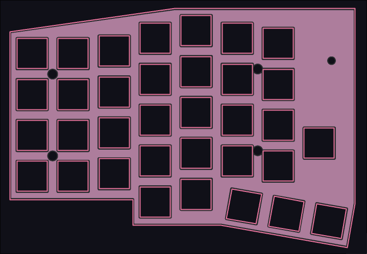

# Merope
## 68 key split mechanical keyboard

Merope is a split mechanical keyboard design based vaguely off the lily58 and other common split keyboards. This one has what I consider to be a pretty agressive colstag. 
There are 7 main columns of 4 rows (for basically 60% coverage), plus 2 mod row keys, 3 thumb cluster keys, and an inner key above the thumb cluster. Key layout and pictures TBA after I get my hands on everything (PCB currently being fabbed)

Don't have an ergogen as I did the whole thing in KiCad, but here's how the plate looks: 

